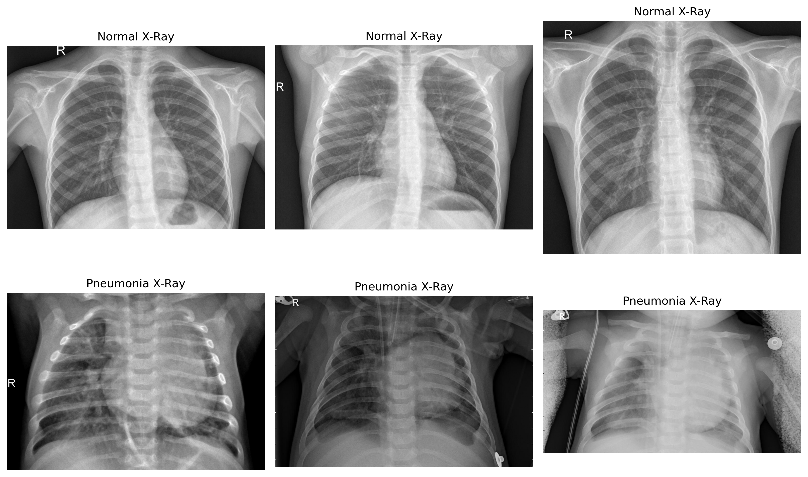
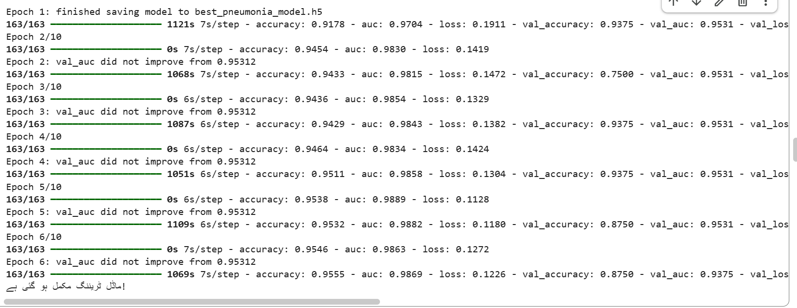
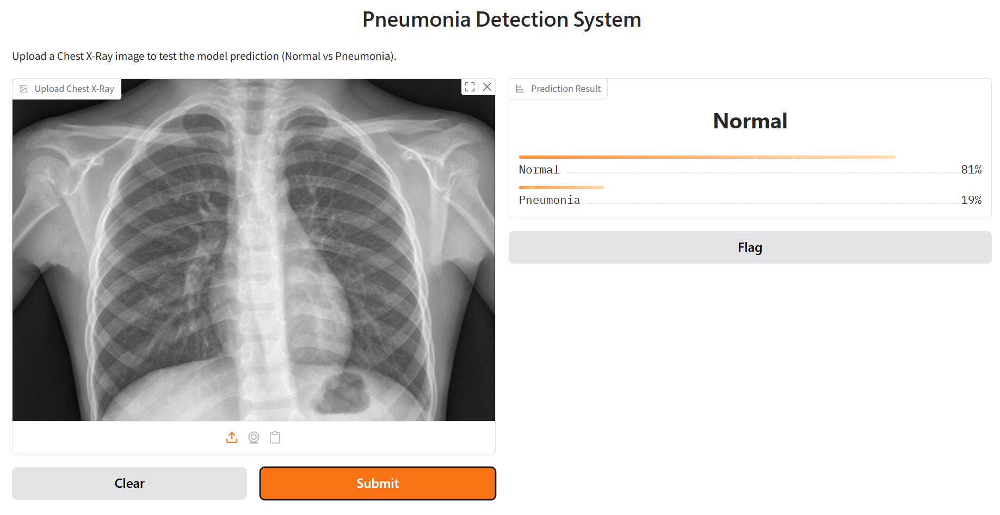
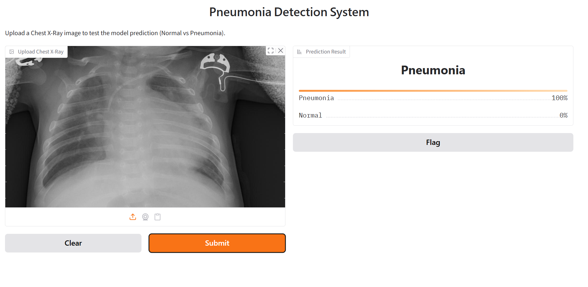

# Pneumonia Detection using Chest X-Ray Images (ResNet50V2)

A deep learning project for detecting pneumonia from chest X-ray images using Convolutional Neural Networks (CNN) and Transfer Learning (ResNet50V2), with an interactive Gradio demo.

## Overview

This project implements and compares two approaches for pneumonia detection:

1. **Custom CNN Model** – A convolutional neural network built from scratch
2. **Transfer Learning Model** – Using pre-trained ResNet50V2 with fine-tuning

## Dataset

The project uses the [Chest X-Ray Pneumonia Dataset](https://www.kaggle.com/datasets/paultimothymooney/chest-xray-pneumonia) from Kaggle, which contains:

- Training images of normal and pneumonia cases
- Validation set
- Test set

Sample images from the dataset:



## Features

**Data Preprocessing:**
- Image erosion and dilation
- Gaussian blur
- Canny edge detection
- HSV color space conversion

**Data Augmentation:**
- Horizontal and vertical flips
- Rotation
- ZCA whitening
- Width and height shifts
- Channel shifts
- Shear and zoom transformations

**Model Architectures:**
- Custom CNN with multiple convolutional and pooling layers
- Transfer Learning using ResNet50V2 pre-trained on ImageNet

**Evaluation Metrics:**
- Accuracy
- Precision
- Recall
- F1-Score
- Confusion Matrix

**Interactive Demo:**
- `app.py` runs a Gradio web app where you can upload a chest X-ray and get a live prediction

## Requirements

Install the required dependencies:

```bash
pip install -r requirements.txt
```

## Project Structure

Pneumonia-Detection-ResNet50V2/
├── pneumonia_detection_training.ipynb # Main training notebook
├── app.py # Gradio demo app
├── requirements.txt # Python dependencies
├── README.md # Project documentation
└── assets/ # Result images and demo screenshots
├── dataset_samples.png
├── training_results.png
├── gradio_demo_normal.png
└── gradio_demo_pneumonia.png


## Usage

1. **Setup Environment**

```bash
   pip install -r requirements.txt
```

2. **Train the Model**

   Open `pneumonia_detection_training.ipynb` in Jupyter Notebook or Google Colab and run all cells. The notebook automatically downloads the dataset from Kaggle using `kagglehub`.

3. **Run the Demo App**

```bash
   python app.py
```

   This launches a local Gradio interface where you can upload a chest X-ray image and see the model's prediction in real time.

4. **Training**

   - The notebook trains both CNN and transfer learning models
   - Uses early stopping to prevent overfitting
   - Includes GPU support for faster training

5. **Model Evaluation**

   - Evaluate on test set
   - Generate confusion matrix
   - Calculate precision, recall, and F1-score

## Models

### Model 1: Custom CNN
- 4 Convolutional blocks with MaxPooling
- Dropout layers for regularization
- 3 Dense layers for classification
- Binary sigmoid output

### Model 2: Transfer Learning (ResNet50V2)
- Pre-trained ResNet50V2 base (frozen layers)
- Custom dense layers on top
- Adam optimizer
- Binary cross-entropy loss

## Results

Training accuracy/loss curves and confusion matrix:



### Gradio Demo in Action

| Normal X-Ray Prediction | Pneumonia X-Ray Prediction |
|---|---|
|  |  |

## GPU Support

The notebook includes GPU detection and configuration for:

- Google Colab (T4 GPU recommended)
- Local GPU setup with TensorFlow

## License

This project is for educational and research purposes.

## Acknowledgments

- Dataset: Paul Mooney (Kaggle)
- Pre-trained models: TensorFlow/Keras Applications
